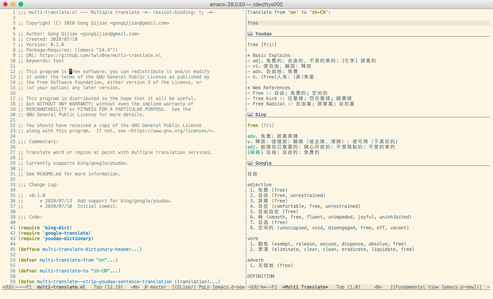

# multi-translate.el

Translate word or region at point with multiple translation services.

Currently supports bing/google/youdao/sdcv.




## Installation

```elisp
(quelpa '(multi-translate
          :fetcher github
          :repo "twlz0ne/multi-translate.el"
          :files ("multi-translate.el")))
```

## Usage

- Move cursor onto a word or mark a region.
- Press `M-x multi-translate-at-point RET`.

    This function will translate word or region from source language to target language.

## Use different backends translate words and sentences

Usally, a local dictionary is enough for words translating, only sentences need
to be send to remote. Following are the relevant custom variables:

- `multi-translate-word-backends` (default `'(sdcv)`)
- `multi-translate-sentence-backends` (default `'(bing google youdao)`)

## Async request

The async request is enabled by default (see `multi-translate-enable-async-request`). But not all backends support async:

| Backends                                                                        | Async              |
|:--------------------------------------------------------------------------------|:------------------:|
| bing([bing-dict](https://github.com/cute-jumper/bing-dict.el))                  | Yes                |
| google([google-translate](https://github.com/atykhonov/google-translate))       | No                 |
| youdao([youdao-dictionary](https://github.com/xuchunyang/youdao-dictionary.el)) | Yes                |
| sdcv([sdcv](http://www.emacswiki.org/emacs/download/sdcv.el))                   | No (not necessary) |
